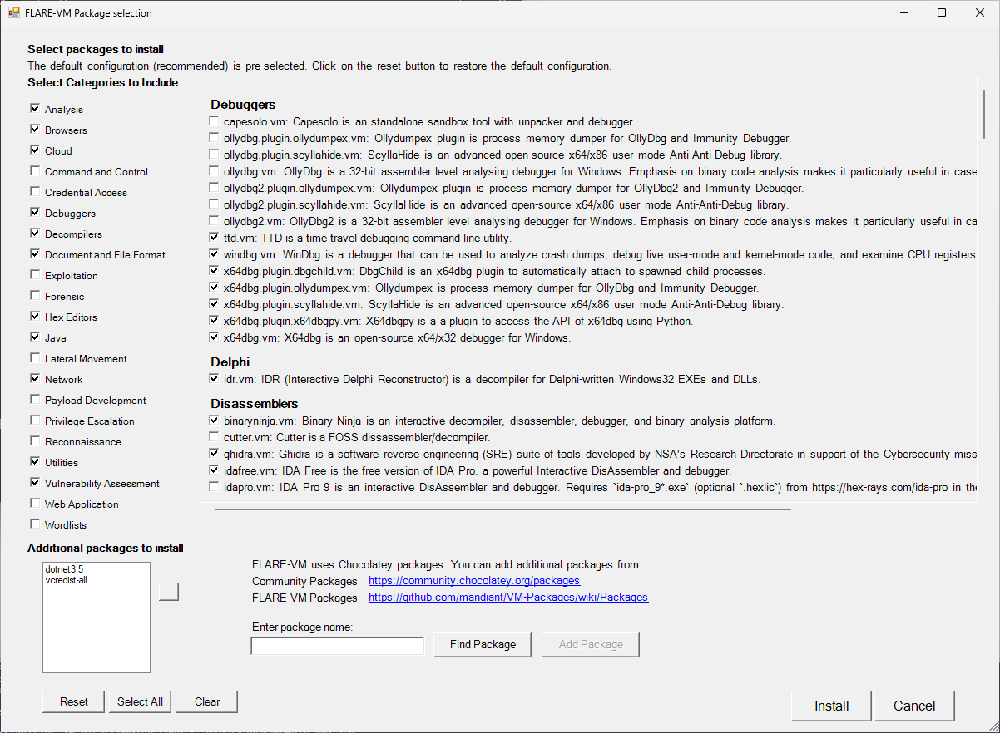

# FLARE-VM
Welcome to FLARE-VM - a collection of software installations scripts for Windows systems that allows you to easily setup and maintain a reverse engineering environment on a virtual machine (VM). FLARE-VM was designed to solve the problem of reverse engineering tool curation and relies on two main technologies: [Chocolatey](https://chocolatey.org) and [Boxstarter](https://boxstarter.org). Chocolatey is a Windows-based Nuget package management system, where a "package" is essentially a ZIP file containing PowerShell installation scripts that download and configure a specific tool. Boxstarter leverages Chocolatey packages to automate the installation of software and create repeatable, scripted Windows environments.

<p align="center">
  
</p>

## Requirements
**FLARE-VM should ONLY be installed on a virtual machine**.
The VM should satisfy the following requirements:

* Windows >= 10
* PowerShell >= 5
* Disk capacity of at least 60 GB and memory of at least 2GB
* Usernames without spaces or other special characters
* Internet connection
* Tamper Protection and any Anti-Malware solution (e.g., Windows Defender) Windows Defender disabled, preferably via Group Policy
* Windows Updates Disabled

## Installation instruction
### Pre-installation
* Prepare a Windows 10+ virtual machine
  * Install Windows in the virtual machine, for example using the raw Windows 10 ISO from https://www.microsoft.com/en-us/software-download/windows10ISO
  * Ensure the [requirements above](#requirements) are satisfied, including:
    * Disable Windows Updates (at least until installation is finished)
      * https://www.windowscentral.com/how-stop-updates-installing-automatically-windows-10
    * Disable Tamper Protection and any Anti-Malware solution (e.g., Windows Defender), preferably via Group Policy.
      * [https://stackoverflow.com/questions/62174426/how-to-permanently-disable-windows-defender-real-time-protection-with-gpo](https://superuser.com/a/1757341)
* Take a VM snapshot so you can always revert to a state before the FLARE-VM installation

### FLARE-VM installation
* Open a `PowerShell` prompt as administrator
* Download the installation script [`installer.ps1`](https://raw.githubusercontent.com/mandiant/flare-vm/main/install.ps1):
  * `(New-Object net.webclient).DownloadFile('https://raw.githubusercontent.com/mandiant/flare-vm/main/install.ps1',"install.ps1")`
* Unblock the installation script:
  * `Unblock-File .\install.ps1`
* Enable script execution:
  * `Set-ExecutionPolicy Unrestricted -Force`
    * If you receive an error saying the execution policy is overridden by a policy defined at a more specific scope, you may need to pass a scope in via `Set-ExecutionPolicy Unrestricted -Scope CurrentUser -Force`. To view execution policies for all scopes, execute `Get-ExecutionPolicy -List`
* Finally, execute the installer script as follow:
  * `.\install.ps1`
    * To pass your password as an argument: `.\install.ps1 -password <password>`
    * To use the CLI-only mode with minimal user interaction: `.\install.ps1 -password <password> -noWait -noGui`
    * To use the CLI-only mode with minimal user interaction and a custom config file: `.\install.ps1 -customConfig <config.xml> -password <password> -noWait -noGui`
* After installation it is recommended to switch to `host-only` networking mode and take a VM snapshot

#### Installer Parameters
Below are the CLI parameter descriptions.

```
PARAMETERS
    -password <String>
        Current user password to allow reboot resiliency via Boxstarter. The script prompts for the password if not provided.

    -noPassword [<SwitchParameter>]
        Switch parameter indicating a password is not needed for reboots.

    -customConfig <String>
        Path to a configuration XML file. May be a file path or URL.

    -noWait [<SwitchParameter>]
        Switch parameter to skip installation message before installation begins.

    -noGui [<SwitchParameter>]
        Switch parameter to skip customization GUI.

    -noReboots [<SwitchParameter>]
        Switch parameter to prevent reboots (not recommended).

    -noChecks [<SwitchParameter>]
        Switch parameter to skip validation checks (not recommended).
```

Get full usage information by running `Get-Help .\install.ps1 -Detailed`.

#### Installer GUI

The Installer GUI is display after executing the validation checks and installing Boxstarter and Chocolatey (if they are not installed already).
Using the installer GUI you may customize:
* Package selection
* Environment variable paths



#### Configuration

The installer will download [config.xml](https://raw.githubusercontent.com/mandiant/flare-vm/main/config.xml) from the FLARE-VM repository. This file contains the default configuration, including the list of packages to install and the environment variable paths. You may use your own configuration by specifying the CLI-argument `-customConfig` and providing either a local file path or URL to your `config.xml` file. For example:

```
.\install.ps1 -customConfig "https://raw.githubusercontent.com/mandiant/flare-vm/main/config.xml"
```

#### Post installation steps
You can include any post installation step you like in the configuration inside the tags `apps`, `services`, `path-items`, `registry-items`, and `custom-items`.

For example:
- To show known file extensions:
```xml
    <registry-items>
        <registry-item name="Show known file extensions" path="HKCU:\Software\Microsoft\Windows\CurrentVersion\Explorer\Advanced" value="HideFileExt" type="DWord" data="0"/>
    </registry-items>
```

For more examples, check the default configuration file: [config.xml](https://raw.githubusercontent.com/mandiant/flare-vm/main/config.xml).

## Contributing

Want to get started contributing? See the links below to learn how. We are looking forward working with you to improve FLARE-VM! :sparkling_heart:

### FLARE-VM (this repository)
* FLARE-VM installation script, and configuration: https://github.com/mandiant/flare-vm
  * [Submit improvement proposals and report issues related to the installer](https://github.com/mandiant/flare-vm/issues/new/choose)

### VM-Packages
* Repository of all tool packages: https://github.com/mandiant/VM-Packages
  * [Documentation and contribution guides for tool packages](https://github.com/mandiant/VM-Packages/wiki)
  * [Submit new tool packages or report package related issues](https://github.com/mandiant/VM-Packages/issues/new/choose)

## Troubleshooting
If your installation fails, please attempt to identify the reason for the installation error by reading through the log files listed below on your system:
* `%VM_COMMON_DIR%\log.txt`
* `%PROGRAMDATA%\chocolatey\logs\chocolatey.log`
* `%LOCALAPPDATA%\Boxstarter\boxstarter.log`

Ensure you are running the latest version of the FLARE-VM installer and that your VM satisfies the [requirements](#requirements).

### Installer Error
If the installation failed due to an issue in the installation script (e.g., `install.ps1`), [report the bug in FLARE-VM](https://github.com/mandiant/flare-vm/issues/new?labels=%3Abug%3A+bug&template=bug.yml).
Provide all the information requested to ensure we are able to help you.

> **Note:** Rarely should `install.ps1` be the reason for an installation failure. Most likely it is a specific package or set of packages that are failing (see below).

### Package Error
Packages fail to install from time to time -- this is normal. The most common reasons are outlined below:

1. Failure or timeout from Chocolatey or MyGet to download a `.nupkg` file
2. Failure or timeout due to remote host when downloading a tool
3. Intrusion Detection System (IDS) or AV product (e.g., Windows Defender) prevents a tool download or removes the tool from the system
4. Host specific issue, for example when using an untested version
5. Tool fails to build due to dependencies
6. Old tool URL (e.g., `HTTP STATUS 404`)
7. Tool's SHA256 hash has changed from what is hardcoded in the package installation script

Reasons **1-4** are difficult for us to fix since we do not control them. If an issue related to reasons **1-4** is filed, it is unlikely we will be able to assist.

We can help with reasons **5-7** and welcome the community to contribute fixes as well!
Please [report the bug in VM-Packages](https://github.com/mandiant/VM-Packages/issues/new?labels=%3Abug%3A+bug&template=bug.yml) providing all the information requested.

### Updates

Note that package updates are best effort and that updates are not being tested.
If you encounter errors, perform a fresh FLARE-VM install.

## Legal Notice
> This download configuration script is provided to assist cyber security analysts in creating handy and versatile toolboxes for malware analysis environments. It provides a convenient interface for them to obtain a useful set of analysis tools directly from their original sources. Installation and use of this script is subject to the Apache 2.0 License. You as a user of this script must review, accept and comply with the license terms of each downloaded/installed package. By proceeding with the installation, you are accepting the license terms of each package, and acknowledging that your use of each package will be subject to its respective license terms.

