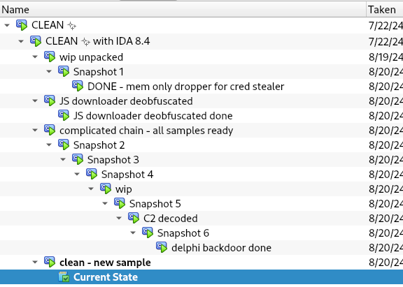

# VirtualBox scripts

**This folder contains several scripts related to enhance building, exporting, and using FLARE-VM in VirtualBox.**

## Export snapshots

[`vbox-export-snapshots.py`](vbox-export-snapshots.py) export one or more snapshots in the same VirtualBox virtual machine (VM) as `.ova`, changing the network adapter to Host-Only.
It also generates a file with the SHA256 hash of the exported `.ova`.
This script is useful to export several versions of FLARE-VM after its installation consistently and with the internet disabled by default (desired for malware analysis).
For example, you may want to export a VM with the default FLARE-VM configuration and another installing in addition the packages `visualstudio.vm` and `pdbs.pdbresym.vm`.
These packages are useful for malware analysis but are not included in the default configuration because of the consequent increase in size.

## Clean up snapshots

It is not possible to select and delete several snapshots in VirtualBox, making cleaning up your VM manually after having creating a lot snapshots time consuming and tedious (possible errors when deleting several snapshots simultaneously).

[`vbox-clean-snapshots.py`](vbox-clean-snapshots.py) cleans a VirtualBox VM up by deleting a snapshot and its children recursively skipping snapshots with a substring in the name.

### Example

```
$ python3 vbox-remove-snapshots.py FLARE-VM.20240604

Cleaning FLARE-VM.20240604 🫧 Snapshots to delete:
  Snapshot 1
  wip unpacked
  JS downloader deobfuscated 
  Snapshot 6
  C2 decoded
  Snapshot 5
  wip
  Snapshot 4
  Snapshot 3
  Snapshot 2
  complicated chain - all samples ready

VM state: Paused
⚠️  Snapshot deleting is slower in a running VM and may fail in a changing state

Confirm deletion ('y'):y

Deleting... (this may take some time, go for an 🍦!)
  🫧 DELETED 'Snapshot 1'
  🫧 DELETED 'wip unpacked'
  🫧 DELETED 'JS downloader deobfuscated '
  🫧 DELETED 'Snapshot 6'
  🫧 DELETED 'C2 decoded'
  🫧 DELETED 'Snapshot 5'
  🫧 DELETED 'wip'
  🫧 DELETED 'Snapshot 4'
  🫧 DELETED 'Snapshot 3'
  🫧 DELETED 'Snapshot 2'
  🫧 DELETED 'complicated chain - all samples ready'

See you next time you need to clean up your VMs! ✨

```

##### Before




##### After


