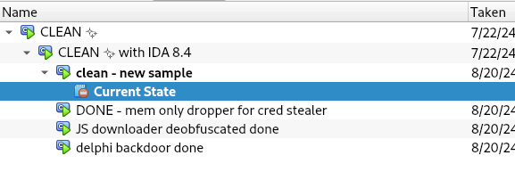
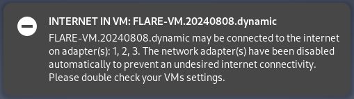

# VirtualBox scripts

**This folder contains several scripts related to enhance building, exporting, and using FLARE-VM in VirtualBox.**
The scripts have been tested in Debian 12 with GNOME 44.9.


## Clean up snapshots

It is not possible to select and delete several snapshots in VirtualBox, making cleaning up your virtual machine (VM) manually after having creating a lot snapshots time consuming and tedious (possible errors when deleting several snapshots simultaneously).

[`vbox-clean-snapshots.py`](vbox-clean-snapshots.py) cleans a VirtualBox VM up by deleting a snapshot and its children recursively skipping snapshots with a substring in the name.

### Example

```
$ ./vbox-remove-snapshots.py FLARE-VM.20240604 --protected empty,clean,done,important

Snapshots with the following strings in the name (case insensitive) won't be deleted:
  clean
  done

Cleaning FLARE-VM.20240604 🫧 Snapshots to delete:
  Snapshot 1
  wip unpacked
  JS downloader deobfuscated 
  Snapshot 6
  C2 decoded
  Snapshot 5
  wip
  Snapshot 4
  Snapshot 3
  Snapshot 2
  complicated chain - all samples ready

VM state: Paused
⚠️  Snapshot deleting is slower in a running VM and may fail in a changing state

Confirm deletion (press 'y'):y

Deleting... (this may take some time, go for an 🍦!)
  🫧 DELETED 'Snapshot 1'
  🫧 DELETED 'wip unpacked'
  🫧 DELETED 'JS downloader deobfuscated '
  🫧 DELETED 'Snapshot 6'
  🫧 DELETED 'C2 decoded'
  🫧 DELETED 'Snapshot 5'
  🫧 DELETED 'wip'
  🫧 DELETED 'Snapshot 4'
  🫧 DELETED 'Snapshot 3'
  🫧 DELETED 'Snapshot 2'
  🫧 DELETED 'complicated chain - all samples ready'

See you next time you need to clean up your VMs! ✨

```

##### Before


##### After




## Check internet adapter status

[`vbox-adapter-check.py`](vbox-adapter-check.py) prints the status of all internet adapters of all VMs in VirtualBox.
If the argument `--dynamic_only` is provided, the script only print the status of the dynamic analysis VM (with `.dynamic` in the name).
Unless the argument `--do_not_modify` is provided, if internet is detected in any dynamic analysis VM, the script sends a notification and changes the adapters type to Host-Only.
The script is useful to detect internet access, which is undesirable for dynamic malware analysis.

### Example

```
$ ~/github/flare-vm/virtualbox/vbox-adapter-check.py
VM {2bc66f50-9ecb-4b10-a4dd-0cc329bc383d} ⚠️  FLARE-VM.testing is connected to the internet on adapter(s): 1
VM {a23c0c37-2062-4cf0-882b-9e9747dd33b6} ✅ REMnux.20241217.dynamic network configuration is ok
VM {fa0b3733-50cb-43fd-8428-745d0e9159cb} ✅ FLARE-VM.Win10.20250211.dynamic network configuration is ok
VM {e5f509ed-cbc8-4abc-b052-664246207e89} ⚠️  FLARE-VM.Win10.20250211.full.dynamic is connected to the internet on adapter(s): 1, 2
VM {e5f509ed-cbc8-4abc-b052-664246207e89} ⚙️  FLARE-VM.Win10.20250211.full.dynamic set adapter 1 to hostonly
VM {e5f509ed-cbc8-4abc-b052-664246207e89} ⚙️  FLARE-VM.Win10.20250211.full.dynamic set adapter 2 to hostonly
```

#### Notification




## Export snapshot

[`vbox-export-snapshot.py`](vbox-export-snapshot.py) exports a VirtualBox snapshot as an Open Virtual Appliance (OVA) file.
The script configures the exported VM with a single Host-Only network interface, and the resulting OVA file is named after the snapshot.
A separate file containing the SHA256 hash of the OVA is also generated for verification.
The script accepts an optional description for the OVA and the name of the export directory within the user's home directory (`$HOME`) where the OVA and SHA256 hash file will be saved.
If no export directory is provided, the default directory name is `EXPORTED VMS`.

### Example

```
$ ./vbox-export-snapshots.py "FLARE-VM.testing" "FLARE-VM" --description "Windows 10 VM with FLARE-VM default configuration"

Exporting snapshot "FLARE-VM" from "FLARE-VM.testing" {2bc66f50-9ecb-4b10-a4dd-0cc329bc383d}...
VM {2bc66f50-9ecb-4b10-a4dd-0cc329bc383d} ✨ restored snapshot "FLARE-VM"
VM {2bc66f50-9ecb-4b10-a4dd-0cc329bc383d} state: saved. Starting VM...
VM {2bc66f50-9ecb-4b10-a4dd-0cc329bc383d} state: running. Shutting down VM...
VM {2bc66f50-9ecb-4b10-a4dd-0cc329bc383d} ⚙️  network set to single hostonly adapter
VM {2bc66f50-9ecb-4b10-a4dd-0cc329bc383d} 🔄 power cycling before export... (it will take some time, go for an 🍦!)
VM {2bc66f50-9ecb-4b10-a4dd-0cc329bc383d} state: poweroff. Starting VM...
VM {2bc66f50-9ecb-4b10-a4dd-0cc329bc383d} state: running. Shutting down VM...
VM {2bc66f50-9ecb-4b10-a4dd-0cc329bc383d} 🚧 exporting ... (it will take some time, go for an 🍦!)
VM {2bc66f50-9ecb-4b10-a4dd-0cc329bc383d} ✅ EXPORTED "/home/anamg/None/FLARE-VM.ova"
VM {2bc66f50-9ecb-4b10-a4dd-0cc329bc383d} ✅ GENERATED "/home/anamg/None/FLARE-VM.ova.sha256": 987eed68038ce7c5072e7dc219ba82d11745267d8ab2ea7f76158877c13e3aa9
```

## Build FLARE-VM VM(s)

[`vbox-build-flare-vm.py`](vbox-build-flare-vm.py) automates the creation and export of customized FLARE-VM VMs.
The script begins by restoring a pre-existing `BUILD-READY` snapshot of a clean Windows installation.
The script then copies the required installation files (such as the IDA Pro installer, FLARE-VM configuration, and legal notices) into the guest VM.
After installing FLARE-VM, a `base` snapshot is taken.
This snapshot serves as the foundation for generating subsequent snapshots and exporting OVA images, all based on the configuration provided in a YAML file.
This configuration file specifies the VM name, the exported VM name, and details for each snapshot.
Individual snapshot configurations can include custom commands to be executed within the guest, legal notices to be applied, and file/folder exclusions for the automated cleanup process.
See the configuration example file [`configs/win10_flare-vm.yaml`](configs/win10_flare-vm.yaml).

The `BUILD-READY` snapshot is expected to be an empty Windows installation that satisfies the FLARE-VM installation requirements and has UAC disabled.
To disable UAC execute in a cmd console with admin rights and restart the VM for the change to take effect:
```
%windir%\System32\reg.exe ADD HKLM\SOFTWARE\Microsoft\Windows\CurrentVersion\Policies\System /v EnableLUA /t REG_DWORD /d 0 /f
```

## Build REMnux VM

Similarly to [`vbox-build-flare-vm.py`](vbox-build-flare-vm.py), [`vbox-build-remnux.py`](vbox-build-remnux.py) automates the creation and export of customized REMnux virtual machines (VMs).
The script begins by restoring a pre-existing "BUILD-READY" snapshot of a clean REMnux OVA.
Required installation files (such as the IDA Pro installer and ZIPs with GNOME extensions) are then copied into the guest VM.
The configuration file specifies the VM name, the exported VM name, and details for each snapshot.
Individual snapshot configurations include the extension, description, and custom commands to be executed within the guest.
See the configuration example file [`configs/remnux.yaml`](configs/remnux.yaml).
